<div align="center">



# 🚗 Awesome Telematics Insurance Platform 🛡️

### *The Definitive Directory of SaaS Platforms & Open-Source Projects for Usage-Based Insurance (UBI), PHYD, PAYD, Driver Risk Analytics & Connected Insurance*

<p align="center">
  <a href="https://github.com/ishandutta2007/Awesome-Awesome-Awesome"></a>
  <a href="https://discord.gg/jc4xtF58Ve"></a>
  <a href="https://github.com/ishandutta2007/Awesome-Telematics-Insurance-Platform/stargazers"></a>
  <a href="https://github.com/ishandutta2007/Awesome-Telematics-Insurance-Platform/network/members"></a>
  <a href="https://github.com/ishandutta2007/Awesome-Telematics-Insurance-Platform/blob/main/LICENSE"></a>
  <a href="https://github.com/ishandutta2007/Awesome-Telematics-Insurance-Platform/pulls"></a>
  <a href="https://github.com/ishandutta2007"></a>
</p>

---

**Last updated: August 2026** • *Curated with ❤️ for InsurTech Engineers, Actuaries, Data Scientists & Mobility Developers*

</div>

---

## 🔍 Overview & SEO Highlights

This repository tracks notable **SaaS platforms** and **open-source projects** for **Telematics Insurance**, **Usage-Based Insurance (UBI)**, **Pay-As-You-Drive (PAYD)**, **Pay-How-You-Drive (PHYD)**, and **Connected Vehicle Risk Analytics**.

These platforms collect and analyze vehicle and driver data from smartphones, OBD-II dongles, CAN-bus networks, connected cars, telematics control units (TCUs), GPS, accelerometers, and other IoT sensors to support:
- 📊 **Usage-Based Insurance (UBI)** — Mileage-dependent Pay-As-You-Drive (PAYD) & behavior-dependent Pay-How-You-Drive (PHYD).
- 🧠 **AI Driver Risk Scoring** — Real-time crash risk classification, harsh event detection (braking/cornering/acceleration), and distraction monitoring.
- 💥 **Automated Crash Detection & FNOL** — Instant First Notice of Loss, impact reconstruction, and claims triage intelligence.
- 🎯 **Actuarial Modeling & Dynamic Pricing** — Generalized Linear Models (GLMs), Hidden Markov Models (HMMs), and gradient-boosted risk pipelines.
- 📱 **Driver Coaching & Gamification** — Safe driving scorecards, eco-driving feedback, carbon footprint tracking, and policyholder rewards.

Contributions welcome! Open a PR to add or update entries.

---

## 📑 Table of Contents

- [🏢 SaaS / Hosted Telematics Platforms](#-saas--hosted-telematics-platforms)
- [⭐ Open-Source Ecosystem Leaderboard](#-open-source-ecosystem-leaderboard)
- [💻 Open-Source GitHub Projects by Category](#-open-source-github-projects-by-category)
  - [🤖 Driver Risk Modeling & Machine Learning](#-driver-risk-modeling--machine-learning)
  - [🛰️ Autonomous Systems & Vehicle Simulation](#-autonomous-systems--vehicle-simulation)
  - [⚡ Event Streaming & Telematics Data Ingestion](#-event-streaming--telematics-data-ingestion)
  - [📡 Fleet Telematics & IoT Tracking](#-fleet-telematics--iot-tracking)
  - [🗺️ Geospatial Analytics, Routing & Map Matching](#-geospatial-analytics-routing--map-matching)
  - [🔌 OBD-II, CAN Bus & In-Vehicle Telemetry](#-obd-ii-can-bus--in-vehicle-telemetry)
  - [📱 Mobile Sensing & Smartphone UBI SDKs](#-mobile-sensing--smartphone-ubi-sdks)
  - [📋 Specialized Insurance Telematics & Fleet Portals](#-specialized-insurance-telematics--fleet-portals)
- [🏗️ Building a Custom Open-Source Telematics Insurance Platform](#-building-a-custom-open-source-telematics-insurance-platform)
- [⭐ Star History](#-star-history)
- [🤝 How to Contribute](#-how-to-contribute)
- [⚠️ Disclaimer](#-disclaimer)

---

## 🏢 SaaS / Hosted Telematics Platforms

The table below catalogs enterprise commercial platforms providing connected car data, driver risk intelligence, and end-to-end UBI management. **Sorted in descending order by Company Size (Valuation / Revenue)**.

| Platform | Company Size (Valuation / Revenue) | Category / Focus | Key Capabilities | Pricing (Starting Tier / Rates) | Free Tier & Free Trial Limits |
| :--- | :--- | :--- | :--- | :--- | :--- |
| **[LexisNexis Risk Solutions](https://risk.lexisnexis.com/)** | **~$70B+ Mkt Cap** (RELX) / ~£2.0B ($2.6B) Rev | Telematics Risk Analytics | Telematics OnDemand, DriveMetrics scoring, OEM data exchange, claims automation | Starts from ~$0.75–$2.50 per report / policyholder verification | Carrier-assisted sandbox access & 30-day historical validation pilot study |
| **[Verisk Telematics](https://www.verisk.com/)** | **~$24B–$35B Mkt Cap** (NASDAQ: VRSK) / ~$3.1B Rev | InsurTech Data Exchange | Telematics Data Prefill, driver risk scoring, OEM connected car data network | Starts from ~$0.50–$2.00 per inquiry / prefill transaction for licensed insurers | Carrier sandbox environment & retrospective portfolio backtesting pilot |
| **[Samsara](https://www.samsara.com/)** | **~$22.7B Mkt Cap** (NYSE: IOT) / ~$1.73B ARR | Fleet & Video Telematics | Real-time GPS, AI dash cams, safety risk scores, fleet insurance integrations | Starts at $27/vehicle/month for core telematics ($40–$60/mo with AI dash cams; hardware $99–$548/unit; 3-yr term) | 30-day risk-free hardware trial program (hardware returnable within 30 days) |
| **[HUK-COBURG Telematik Plus](https://www.huk.de/)** | **€8.5B+ ($9.3B) Rev** (Largest German Auto Insurer) | Consumer UBI Program | Windshield sensor + "HUK Mein Auto" app, driving score calculation, cash discounts | €0 / year extra cost (Guarantees 5% initial discount and up to 30% annual policy discount) | 100% Free permanent program for policyholders, includes complimentary physical telematics sensor |
| **[Cambridge Mobile Telematics (CMT)](https://www.cmtelematics.com/)** | **~$6.0B Valuation** / ~$85M+ Rev | Smartphone & Tag Telematics | DriveWell platform, crash detection, driver risk scoring, claim alerting | Starts from ~$1.50–$3.00/driver/month (enterprise volume tier) | 30-day proof-of-concept (PoC) carrier pilot + interactive sandbox demo |
| **[Geotab](https://www.geotab.com/)** | **~$5.0B+ Valuation** (Private) / ~$970M+ Rev | Enterprise Fleet Telematics | MyGeotab platform, GO9 devices, driver safety scorecards, insurance marketplace | Starts at $20–$40/vehicle/month via authorized resellers (hardware ~$80–$150/unit) | 30-day pilot trial program with evaluation demo hardware units |
| **[Arity](https://arity.com/)** | **~$1.0B+ Valuation** (~$45B Parent Allstate) | Mobility Intelligence & Scoring | Arity IQ at-quote driver risk score, driving engine SDK, crash detection | Starts from ~$0.10–$0.25 per score lookup / API transaction (volume dependent) | 30-day sandbox API integration access for certified carrier partners |
| **[Octo Telematics](https://www.octotelematics.com/)** | **~$800M–$1.0B Valuation** / ~$200M+ Rev | Connected Mobility & Insurance | Digital Driver platform, claims intelligence, UBI risk scoring, crash validation | Starts from ~$20–$35/vehicle/month (telematics device + cloud subscription bundle) | 30-day "Digital Driver™ Try Before You Buy" pilot for policyholder risk pre-scoring |
| **[Nauto](https://www.nauto.com/)** | **~$400M+ Valuation** ($180M+ VC Funding) | AI Fleet Safety & Video Telematics | Real-time distracted driving alerts, AI dual-facing dash cams, collision prevention | Starts at $25/unit/month plus $375 one-time hardware fee per vehicle (1-year minimum contract) | 30-day pilot evaluation program for qualified enterprise fleets |
| **[Otonomo (Ridecell)](https://www.ridecell.com/)** | **~$250M+ Valuation** | Connected Vehicle Data Platform | OEM vehicle data aggregation, fleet automation, driving behavior APIs | Starts from $10–$25/vehicle/month for connected data and fleet workflow automation | 30-day developer sandbox environment & enterprise PoC integration |
| **[IMS (Intelligent Mechatronic Systems)](https://www.intellimec.com/)** | **~$150M–$200M Valuation** (Trak Global) | Connected Car & UBI Platform | DriveSync platform, OneApp mobile SDK, OBD/OEM data normalization, claims scoring | Starts from ~$15–$30/vehicle/month for data ingestion & risk scoring | Enterprise pilot package offering up to 5 self-install OBD test dongles and 30-day portal access |
| **[Mojio](https://www.moj.io/)** | **~$150M+ Valuation** ($70M+ VC Funding) | Connected Car & Fleet Tracking | Force Fleet Tracking, OBD-II data platform, vehicle health, driver behavior | Starts at $10/vehicle/month for Force Fleet Tracking (hardware separate) | Free developer sandbox access with virtual vehicle simulator, mobile SDKs, and REST API access |
| **[TrueMotion](https://www.truemotion.com/)** | **~$150M–$200M Acquired Value** | Mobile Telematics & UBI | Distracted driving analytics, trip scoring, crash response *(Acquired by CMT)* | Integrated into CMT DriveWell (formerly started at ~$2.00–$4.00/user/month) | 30-day enterprise evaluation pilot through CMT DriveWell platform |
| **[Zendrive](https://www.zendrive.com/)** | **~$100M+ Valuation** (Acquired by Credit Karma) | Smartphone Telematics SDK | Mobile sensor risk scoring, collision detection, aggressive driving alerts | Starts at $4.00/driver/month for enterprise fleets / UBI programs | 30-day pilot testing program and developer sandbox access |
| **[Vulog](https://www.vulog.com/)** | **~$50M–$80M Valuation** ($40M+ Funding) | Shared Mobility & Fleet Telematics | AiMA platform, connected fleet management, carsharing telematics, risk analytics | Starts from €15–€35/vehicle/month for connected vehicle fleet management | 30-day structured sandbox demo environment & guided solution simulation |
| **[Greater Than](https://www.greater-than.eu/)** | **~$30M–$50M Mkt Cap** (STO: GREAT) | AI Driver Risk & Eco Scoring | Econaisance AI, crash probability modeling, climate impact analytics | Starts at €1.00–€2.50/active driver/month for AI scoring API | 30-day historical data pilot analysis & guided AI score simulator demo |
| **[DriveQuant](https://www.drivequant.com/)** | **~$30M–$50M Valuation** (FairConnect Group) | Smartphone Telematics & White-Label Apps | DriveKit SDK, driver coaching, eco-driving, smartphone crash detection | Starts at €0.50–€1.50/active driver/month (starter tier package for pilot fleets) | 100% Free DriveKit Demo App (iOS/Android) for live testing + 30-day sandbox API trial upon request |
| **[Wejo](https://www.wejo.com/)** | **Inactive / Liquidated** *(Hist. Peak ~$800M)* | Connected Car Data Exchange *(Historical)* | High-volume connected vehicle data feeds, traffic intelligence, collision data | Inactive / Defunct (Assets liquidated post-May 2023 administration) | Inactive (Historical service formerly offered limited sandbox hackathon keys) |

---

## ⭐ Open-Source Ecosystem Leaderboard

| Rank | Project | Primary Domain | GitHub Stars Badge | License |
| :---: | :--- | :--- | :---: | :---: |
| 1 | **[PyTorch](https://github.com/pytorch/pytorch)** | Deep Learning / Multi-Modal Telematics | [](https://github.com/pytorch/pytorch/stargazers) | BSD-3-Clause |
| 2 | **[scikit-learn](https://github.com/scikit-learn/scikit-learn)** | Actuarial Risk & Feature Classification | [](https://github.com/scikit-learn/scikit-learn/stargazers) | BSD-3-Clause |
| 3 | **[openpilot](https://github.com/commaai/openpilot)** | Autonomous Driving & CAN Telemetry | [](https://github.com/commaai/openpilot/stargazers) | MIT |
| 4 | **[Apache Spark](https://github.com/apache/spark)** | Distributed Telematics Batch Analytics | [](https://github.com/apache/spark/stargazers) | Apache-2.0 |
| 5 | **[Apache Kafka](https://github.com/apache/kafka)** | High-Throughput Vehicle Ingestion | [](https://github.com/apache/kafka/stargazers) | Apache-2.0 |
| 6 | **[XGBoost](https://github.com/dmlc/xgboost)** | Gradient-Boosted Claim Severity & Frequency | [](https://github.com/dmlc/xgboost/stargazers) | Apache-2.0 |
| 7 | **[Apache Flink](https://github.com/apache/flink)** | Real-Time Complex Event Processing (CEP) | [](https://github.com/apache/flink/stargazers) | Apache-2.0 |
| 8 | **[Node-RED](https://github.com/node-red/node-red)** | Low-Code Telematics Workflow Ingestion | [](https://github.com/node-red/node-red/stargazers) | Apache-2.0 |
| 9 | **[ThingsBoard](https://github.com/thingsboard/thingsboard)** | IoT Telemetry & Vehicle Gateway Platform | [](https://github.com/thingsboard/thingsboard/stargazers) | Apache-2.0 |
| 10 | **[LightGBM](https://github.com/microsoft/LightGBM)** | Ultra-Fast Telematics Actuarial Modeling | [](https://github.com/microsoft/LightGBM/stargazers) | MIT |
| 11 | **[CARLA Simulator](https://github.com/carla-simulator/carla)** | Autonomous & Crash Telemetry Simulation | [](https://github.com/carla-simulator/carla/stargazers) | MIT |
| 12 | **[Eclipse Mosquitto](https://github.com/eclipse-mosquitto/mosquitto)** | Lightweight Vehicle MQTT Broker | [](https://github.com/eclipse-mosquitto/mosquitto/stargazers) | EPL-2.0 |
| 13 | **[Traccar](https://github.com/traccar/traccar)** | Multi-Protocol GPS & Fleet Telematics | [](https://github.com/traccar/traccar/stargazers) | Apache-2.0 |
| 14 | **[OSRM Backend](https://github.com/Project-OSRM/osrm-backend)** | High-Speed Map Matching & Routing | [](https://github.com/Project-OSRM/osrm-backend/stargazers) | BSD-2-Clause |
| 15 | **[GraphHopper](https://github.com/graphhopper/graphhopper)** | Fast Route Profiling & Matrix Calculations | [](https://github.com/graphhopper/graphhopper/stargazers) | Apache-2.0 |
| 16 | **[H3 Geospatial Index](https://github.com/uber/h3)** | Hexagonal Spatial Telematics Indexing | [](https://github.com/uber/h3/stargazers) | Apache-2.0 |
| 17 | **[Valhalla](https://github.com/valhalla/valhalla)** | Multi-Modal Route & Elevation Matching | [](https://github.com/valhalla/valhalla/stargazers) | MIT |
| 18 | **[OpenStreetMap Website](https://github.com/openstreetmap/openstreetmap-website)** | Global Geospatial Infrastructure | [](https://github.com/openstreetmap/openstreetmap-website/stargazers) | GPL-2.0 |
| 19 | **[PostGIS](https://github.com/postgis/postgis)** | Spatial Database for Trajectories & Geofences | [](https://github.com/postgis/postgis/stargazers) | GPL-2.0 |
| 20 | **[GPSLogger](https://github.com/mendhak/gpslogger)** | Open-Source Android GPS / IMU Logger | [](https://github.com/mendhak/gpslogger/stargazers) | GPL-2.0 |
| 21 | **[python-can](https://github.com/hardbyte/python-can)** | Vehicle Controller Area Network SDK | [](https://github.com/hardbyte/python-can/stargazers) | LGPL-3.0 |
| 22 | **[Cabana](https://github.com/commaai/cabana)** | CAN Bus Visualizer & Reverse Engineering | [](https://github.com/commaai/cabana/stargazers) | MIT |
| 23 | **[python-OBD](https://github.com/brendan-w/python-OBD)** | OBD-II Diagnostics & Telemetry Library | [](https://github.com/brendan-w/python-OBD/stargazers) | GPL-2.0 |
| 24 | **[SavvyCAN](https://github.com/collin80/SavvyCAN)** | CAN Bus Reverse Engineering & Sniffing | [](https://github.com/collin80/SavvyCAN/stargazers) | MIT |
| 25 | **[OwnTracks Recorder](https://github.com/owntracks/recorder)** | Private Location Ingestion & Storage | [](https://github.com/owntracks/recorder/stargazers) | GPL-2.0 |
| 26 | **[Panda](https://github.com/commaai/panda)** | Universal OBD-II & CAN Vehicle Hardware Interface | [](https://github.com/commaai/panda/stargazers) | MIT |
| 27 | **[MDS Specification](https://github.com/openmobilityfoundation/mobility-data-specification)** | Shared Mobility & Telematics Data Standard | [](https://github.com/openmobilityfoundation/mobility-data-specification/stargazers) | Apache-2.0 |
| 28 | **[Eclipse Ditto](https://github.com/eclipse-ditto/ditto)** | Connected Vehicle Digital Twin Framework | [](https://github.com/eclipse-ditto/ditto/stargazers) | EPL-2.0 |
| 29 | **[BUSMASTER](https://github.com/rbei-etas/busmaster)** | Automotive Bus Analysis & Simulation Tool | [](https://github.com/rbei-etas/busmaster/stargazers) | LGPL-2.1 |
| 30 | **[Eclipse Hono](https://github.com/eclipse-hono/hono)** | Large-Scale IoT Device Connectivity Layer | [](https://github.com/eclipse-hono/hono/stargazers) | EPL-2.0 |
| 31 | **[OpenXC](https://github.com/openxc/openxc)** | Ford Open-Source Vehicle Data Standard | [](https://github.com/openxc/openxc/stargazers) | BSD-2-Clause |
| 32 | **[CANtact](https://github.com/linklayer/cantact)** | Open Hardware CAN Bus Toolchain | [](https://github.com/linklayer/cantact/stargazers) | MIT |
| 33 | **[Open mHealth Schemas](https://github.com/openmhealth/web-schemas)** | Mobile Sensor Schemas & Normalization | [](https://github.com/openmhealth/web-schemas/stargazers) | BSD-2-Clause |
| 34 | **[Zenroad Android App](https://github.com/Mobile-Telematics/TelematicsApp-Android)** | Open-Source Android UBI & Driving App | [](https://github.com/Mobile-Telematics/TelematicsApp-Android/stargazers) | Apache-2.0 |
| 35 | **[Zenroad iOS App](https://github.com/Mobile-Telematics/TelematicsApp-iOS)** | Open-Source iOS UBI & Driving App | [](https://github.com/Mobile-Telematics/TelematicsApp-iOS/stargazers) | Apache-2.0 |
| 36 | **[SensorLogger](https://github.com/tszheichoi/awesome-sensor-logger)** | Smartphone Accelerometer & GPS Logger | [](https://github.com/tszheichoi/awesome-sensor-logger/stargazers) | MIT |
| 37 | **[insurance-telematics](https://github.com/burning-cost/insurance-telematics)** | HMM-Based GLM Insurance Risk Features | [](https://github.com/burning-cost/insurance-telematics/stargazers) | MIT |
| 38 | **[Fleet Management System (sachnaror)](https://github.com/sachnaror/fleet-management-system)** | FastAPI Telematics Dashboard & Harsh Braking | [](https://github.com/sachnaror/fleet-management-system/stargazers) | MIT |
| 39 | **[Fleet Management System (santoshiimind)](https://github.com/santoshiimind/fleet-management-system)** | Python CAN & OBD-II Driver Safety System | [](https://github.com/santoshiimind/fleet-management-system/stargazers) | MIT |

---

## 💻 Open-Source GitHub Projects by Category

### 🤖 Driver Risk Modeling & Machine Learning

Tools for driver risk scoring, actuarial claims prediction, harsh event detection, and multi-modal trajectory learning. **Sorted by stars (descending)**.

- **[PyTorch](https://github.com/pytorch/pytorch)** [](https://github.com/pytorch/pytorch/stargazers)  
  Leading deep learning framework used for recurrent and transformer neural networks on continuous GPS trajectories, multi-axis IMU accelerometer signals, in-cabin camera streams, and sensor-fusion crash prediction.
- **[scikit-learn](https://github.com/scikit-learn/scikit-learn)** [](https://github.com/scikit-learn/scikit-learn/stargazers)  
  Essential machine-learning library for driver risk clustering, behavioral segmentation, anomaly detection, Poisson regression for claim frequency, and feature importance analysis.
- **[XGBoost](https://github.com/dmlc/xgboost)** [](https://github.com/dmlc/xgboost/stargazers)  
  Industrial gradient-boosting framework widely utilized by actuarial data teams for PHYD risk scorecard construction, claim frequency/severity prediction, and telematics feature evaluation.
- **[LightGBM](https://github.com/microsoft/LightGBM)** [](https://github.com/microsoft/LightGBM/stargazers)  
  High-performance gradient boosting framework optimized for large-scale, high-cardinality telematics feature sets and real-time inference pricing engines.
- **[insurance-telematics](https://github.com/burning-cost/insurance-telematics)** [](https://github.com/burning-cost/insurance-telematics/stargazers)  
  Specialized open-source Python library converting raw GPS and accelerometer trip data into GLM-ready insurance risk features using Hidden Markov Models (HMMs). Designed specifically for UBI/PAYD/PHYD actuarial explainability.

---

### 🛰️ Autonomous Systems & Vehicle Simulation

Open platforms for autonomous vehicle telemetry, hardware-in-the-loop (HIL) testing, and simulated sensor stream generation. **Sorted by stars (descending)**.

- **[openpilot](https://github.com/commaai/openpilot)** [](https://github.com/commaai/openpilot/stargazers)  
  Open-source advanced driver assistance system (ADAS) that logs and processes petabytes of real-world vehicle CAN bus, video, and IMU sensor data.
- **[CARLA Simulator](https://github.com/carla-simulator/carla)** [](https://github.com/carla-simulator/carla/stargazers)  
  Open-source autonomous driving simulator for synthetic telematics data generation, crash simulation physics, and extreme event scenario generation for insurance algorithms.

---

### ⚡ Event Streaming & Telematics Data Ingestion

High-throughput, low-latency streaming infrastructure for real-time connected vehicle telemetry. **Sorted by stars (descending)**.

- **[Apache Spark](https://github.com/apache/spark)** [](https://github.com/apache/spark/stargazers)  
  Unified engine for large-scale distributed batch processing, feature store computations, and historical trajectory analytics across millions of vehicles.
- **[Apache Kafka](https://github.com/apache/kafka)** [](https://github.com/apache/kafka/stargazers)  
  High-throughput distributed event streaming platform serving as the backbone for high-frequency GPS, accelerometer, and CAN telematics message ingestion.
- **[Apache Flink](https://github.com/apache/flink)** [](https://github.com/apache/flink/stargazers)  
  Stateful stream processing engine designed for sub-second trip detection, real-time harsh braking identification, and streaming driving score updates.
- **[Node-RED](https://github.com/node-red/node-red)** [](https://github.com/node-red/node-red/stargazers)  
  Low-code event-driven integration platform for connecting telematics devices, MQTT brokers, databases, and policy administration webhooks.
- **[Eclipse Mosquitto](https://github.com/eclipse-mosquitto/mosquitto)** [](https://github.com/eclipse-mosquitto/mosquitto/stargazers)  
  Lightweight open-source MQTT message broker ideal for resource-constrained OBD-II dongles, embedded telematics control units (TCUs), and mobile clients.
- **[Eclipse Ditto](https://github.com/eclipse-ditto/ditto)** [](https://github.com/eclipse-ditto/ditto/stargazers)  
  Digital twin framework providing structured virtual representations of connected vehicles, vehicle health state, and live telemetry mirrors.
- **[Eclipse Hono](https://github.com/eclipse-hono/hono)** [](https://github.com/eclipse-hono/hono/stargazers)  
  IoT connectivity platform designed to connect millions of telematics units uniformly over MQTT, HTTP, and AMQP protocols.

---

### 📡 Fleet Telematics & IoT Tracking

Fleet management, asset tracking, and device management servers. **Sorted by stars (descending)**.

- **[ThingsBoard](https://github.com/thingsboard/thingsboard)** [](https://github.com/thingsboard/thingsboard/stargazers)  
  Open-source IoT platform for device connectivity, telemetry visualization, rule engine alert dispatching, and multi-tenant fleet telematics dashboards.
- **[Traccar](https://github.com/traccar/traccar)** [](https://github.com/traccar/traccar/stargazers)  
  Enterprise-grade open-source GPS tracking system supporting over 1,500 telematics device protocols, real-time geofencing, speeding alerts, and trip history.
- **[OwnTracks Recorder](https://github.com/owntracks/recorder)** [](https://github.com/owntracks/recorder/stargazers)  
  Lightweight self-hosted backend service for receiving and storing private mobile geolocation streams via HTTP and MQTT.
- **[MDS (Mobility Data Specification)](https://github.com/openmobilityfoundation/mobility-data-specification)** [](https://github.com/openmobilityfoundation/mobility-data-specification/stargazers)  
  Standardized open data specification managed by the Open Mobility Foundation for managing shared connected vehicle fleets and telematics feeds.

---

### 🗺️ Geospatial Analytics, Routing & Map Matching

Geographic information systems, road network analysis, map matching, and spatial risk indexing. **Sorted by stars (descending)**.

- **[OSRM Backend](https://github.com/Project-OSRM/osrm-backend)** [](https://github.com/Project-OSRM/osrm-backend/stargazers)  
  High-performance C++ routing engine based on OpenStreetMap data, providing fast Hidden Markov Model map-matching for noisy GPS vehicle traces.
- **[GraphHopper](https://github.com/graphhopper/graphhopper)** [](https://github.com/graphhopper/graphhopper/stargazers)  
  Fast Java routing engine supporting map matching, custom road classification weighting, distance matrices, and elevation analysis.
- **[H3 Geospatial Index](https://github.com/uber/h3)** [](https://github.com/uber/h3/stargazers)  
  Hexagonal hierarchical spatial index developed by Uber, ideal for territory risk scoring, telematics heatmaps, and spatial driving exposure aggregation.
- **[Valhalla](https://github.com/valhalla/valhalla)** [](https://github.com/valhalla/valhalla/stargazers)  
  Modular open-source routing engine with dynamic costing, time-distance calculations, and map-matching tailored for connected vehicle analytics.
- **[OpenStreetMap Website](https://github.com/openstreetmap/openstreetmap-website)** [](https://github.com/openstreetmap/openstreetmap-website/stargazers)  
  The collaborative global mapping project providing free geographic data, speed limits, and road attributes for context-aware driving risk models.
- **[PostGIS](https://github.com/postgis/postgis)** [](https://github.com/postgis/postgis/stargazers)  
  Spatial database extension for PostgreSQL, providing spatial indexing, trajectory partitioning, geofence polygons, and distance calculations.

---

### 🔌 OBD-II, CAN Bus & In-Vehicle Telemetry

Hardware interfaces, diagnostic protocol decoders, and vehicle bus analysis libraries. **Sorted by stars (descending)**.

- **[python-can](https://github.com/hardbyte/python-can)** [](https://github.com/hardbyte/python-can/stargazers)  
  Comprehensive Python library providing Controller Area Network support for interacting with CAN interfaces, bus logging, and message decoding.
- **[Cabana](https://github.com/commaai/cabana)** [](https://github.com/commaai/cabana/stargazers)  
  Open-source web tool for viewing and reverse engineering CAN bus signals, DBC editing, and live automotive stream graphing.
- **[python-OBD](https://github.com/brendan-w/python-OBD)** [](https://github.com/brendan-w/python-OBD/stargazers)  
  Python library for communicating with OBD-II ELM327 adapters, fetching speed, RPM, throttle position, diagnostic trouble codes (DTCs), and mileage.
- **[SavvyCAN](https://github.com/collin80/SavvyCAN)** [](https://github.com/collin80/SavvyCAN/stargazers)  
  Cross-platform C++/Qt application for capturing, filtering, reverse engineering, and fuzzing vehicle CAN networks.
- **[Panda](https://github.com/commaai/panda)** [](https://github.com/commaai/panda/stargazers)  
  Universal car interface hardware and firmware supporting 3x CAN, LIN, and Kline with high-precision timestamping.
- **[BUSMASTER](https://github.com/rbei-etas/busmaster)** [](https://github.com/rbei-etas/busmaster/stargazers)  
  Open-source PC software for simulating, analyzing, and testing automotive bus systems (CAN, LIN, FlexRay).
- **[OpenXC](https://github.com/openxc/openxc)** [](https://github.com/openxc/openxc/stargazers)  
  Open-source vehicle data platform providing a standardized API for accessing CAN bus parameters without proprietary diagnostic reverse engineering.
- **[CANtact](https://github.com/linklayer/cantact)** [](https://github.com/linklayer/cantact/stargazers)  
  Open-source hardware and software tool for working with CAN networks via USB.

---

### 📱 Mobile Sensing & Smartphone UBI SDKs

Mobile applications and sensor pipelines for smartphone-based driving behavior capture. **Sorted by stars (descending)**.

- **[GPSLogger for Android](https://github.com/mendhak/gpslogger)** [](https://github.com/mendhak/gpslogger/stargazers)  
  Battery-efficient Android GPS and sensor logging app supporting automatic upload to custom servers, OpenStreetMap, and cloud storage.
- **[Open mHealth Schemas](https://github.com/openmhealth/web-schemas)** [](https://github.com/openmhealth/web-schemas/stargazers)  
  Standardized mobile sensor data schemas providing architectural patterns for high-frequency accelerometer and gyroscope data representations.
- **[Zenroad Android App](https://github.com/Mobile-Telematics/TelematicsApp-Android)** [](https://github.com/Mobile-Telematics/TelematicsApp-Android/stargazers)  
  Open-source native Android telematics application offering auto-trip detection, driving behavior scoring, scorecards, and optional OBD connectivity.
- **[Zenroad iOS App](https://github.com/Mobile-Telematics/TelematicsApp-iOS)** [](https://github.com/Mobile-Telematics/TelematicsApp-iOS/stargazers)  
  Open-source native iOS telematics application for UBI tracking, background motion activity detection, trip playback, and driver leaderboards.
- **[SensorLogger](https://github.com/tszheichoi/awesome-sensor-logger)** [](https://github.com/tszheichoi/awesome-sensor-logger/stargazers)  
  Curated mobile sensor-data logging tooling for collecting smartphone IMU, barometer, gyroscope, and GNSS raw streams.

---

### 📋 Specialized Insurance Telematics & Fleet Portals

Full-stack open-source projects designed specifically for telematics insurance and driver behavior analytics. **Sorted by stars (descending)**.

- **[insurance-telematics](https://github.com/burning-cost/insurance-telematics)** [](https://github.com/burning-cost/insurance-telematics/stargazers)  
  Converts raw GPS/accelerometer streams into actuarial risk metrics using Hidden Markov Models (HMMs) and generalized linear modeling.
- **[Fleet Management System — sachnaror](https://github.com/sachnaror/fleet-management-system)** [](https://github.com/sachnaror/fleet-management-system/stargazers)  
  Full-stack telematics platform built with FastAPI, SQLAlchemy, OBD-II/CAN bus ingestion, GPS tracking, and an insurance risk dashboard.
- **[Fleet Management System — santoshiimind](https://github.com/santoshiimind/fleet-management-system)** [](https://github.com/santoshiimind/fleet-management-system/stargazers)  
  Python-based automotive telematics system providing GPS tracking, OBD-II diagnostics, harsh acceleration/braking monitoring, and safety scorecards.

---

## 🏗️ Building a Custom Open-Source Telematics Insurance Platform

A complete production-ready open-source telematics-insurance stack can be synthesized by integrating modular specialized layers:

```text
                       ┌──────────────────────────────────────────┐
                       │        🚗 Insured Policyholders          │
                       │   Smartphones / Connected Cars / OBD     │
                       └────────────────────┬─────────────────────┘
                                            │
               ┌────────────────────────────┼────────────────────────────┐
               │                            │                            │
        ┌──────▼──────┐              ┌──────▼──────┐              ┌──────▼──────┐
        │  📱 Mobile  │              │  🔌 OBD/CAN │              │  🌐 OEM/API │
        │ Zenroad /   │              │ python-can  │              │ Connected   │
        │ SensorLogger│              │ python-OBD  │              │ Car Gateway │
        └──────┬──────┘              └──────┬──────┘              └──────┬──────┘
               │                            │                            │
               └────────────────────────────┼────────────────────────────┘
                                            │
                               ┌────────────▼────────────┐
                               │ 📡 Telematics Gateway   │
                               │ Mosquitto / Hono /      │
                               │ Traccar Multi-Protocol  │
                               └────────────┬────────────┘
                                            │
                               ┌────────────▼────────────┐
                               │ ⚡ Event Streaming      │
                               │ Apache Kafka / Flink    │
                               └────────────┬────────────┘
                                            │
                     ┌──────────────────────┼──────────────────────┐
                     │                      │                      │
              ┌──────▼──────┐        ┌──────▼──────┐        ┌──────▼──────┐
              │ 🏁 Trip     │        │ 🗺️ Geospatial│        │ 📊 Sensor &  │
              │ Detection   │        │ Map Match   │        │ Feature Extr │
              │ Engine      │        │ OSRM/Valhalla│       │ Harsh Braking│
              └──────┬──────┘        └──────┬──────┘        └──────┬──────┘
                     │                      │                      │
                     └──────────────────────┼──────────────────────┘
                                            │
                               ┌────────────▼────────────┐
                               │ 🗄️ Spatial Data Store   │
                               │ PostgreSQL + PostGIS    │
                               │ + Uber H3 Spatial Index │
                               └────────────┬────────────┘
                                            │
                               ┌────────────▼────────────┐
                               │ 🧠 AI Risk Engine       │
                               │ insurance-telematics    │
                               │ XGBoost / LightGBM /    │
                               │ PyTorch / Scikit-Learn  │
                               └────────────┬────────────┘
                                            │
                     ┌──────────────────────┼──────────────────────┐
                     │                      │                      │
              ┌──────▼──────┐        ┌──────▼──────┐        ┌──────▼──────┐
              │ 💰 UBI /    │        │ 💥 Crash /  │        │ 🏆 Driver    │
              │ PHYD Price  │        │ FNOL Claims │        │ Coaching &   │
              │ Discounts   │        │ Triage      │        │ Rewards App  │
              └──────┬──────┘        └──────┬──────┘        └──────┬──────┘
                     │                      │                      │
                     └──────────────────────┼──────────────────────┘
                                            │
                               ┌────────────▼────────────┐
                               │ 📈 Insurer Analytics    │
                               │ Grafana / Superset BI   │
                               │ Loss Ratio / Exposure   │
                               └─────────────────────────┘
```

---

## ⭐ Star History

[](https://star-history.dera.page/#ishandutta2007/Awesome-Telematics-Insurance-Platform&type=date&legend=top-left)

---

## 🤝 How to Contribute

We welcome community contributions! Follow these steps to submit additions or updates:

1. 🍴 **Fork the repository**.
2. 🌿 **Create a feature branch**: `git checkout -b feature/add-telematics-tool`.
3. 📝 **Add or update entries** in [README.md](README.md) following the existing table or list formatting.
   - For **SaaS entries**: include company size (valuation/revenue), specific starting tier pricing, and free tier/trial limits.
   - For **Open-Source entries**: include name, stargazers link badge with `style=social&color=white`, official repository link, and license.
4. 🚀 **Submit a Pull Request** with a clear explanation of the platform or tool.

---

## ⚠️ Disclaimer

This repository is a community-curated directory intended for educational, technical, and informational purposes. Mention of commercial vendors or open-source projects does not constitute an endorsement. Usage-based insurance programs, driver telematics, and crash detection models must comply with regional insurance regulations, privacy standards (GDPR/CCPA), and automotive data protection laws.

---

<div align="center">
  <sub>Built with ❤️ for the Global Telematics & Connected Insurance Community.</sub>
</div>
